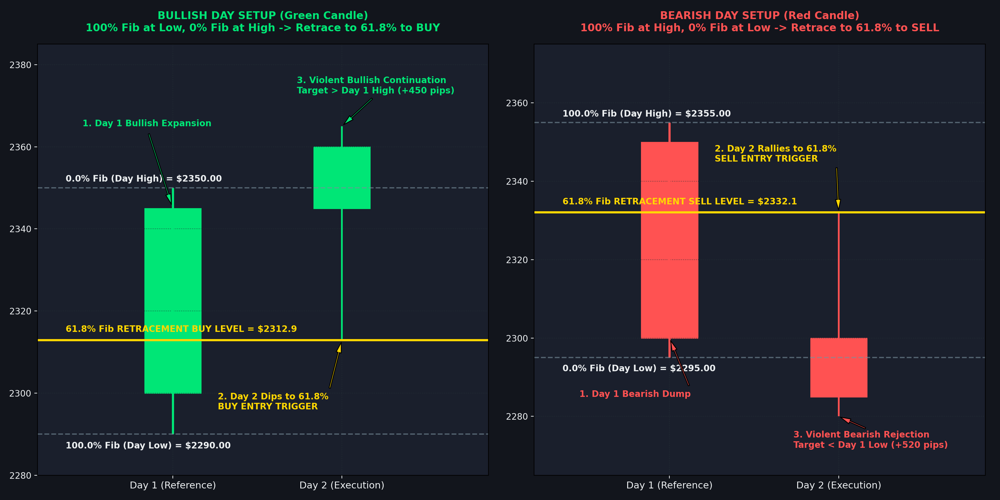
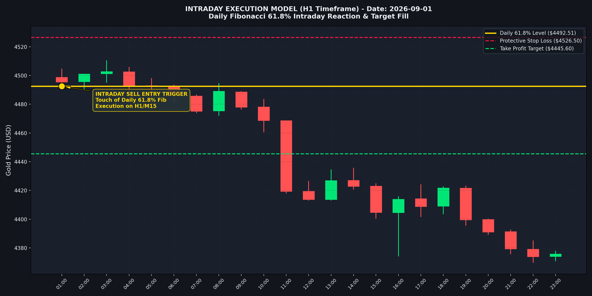
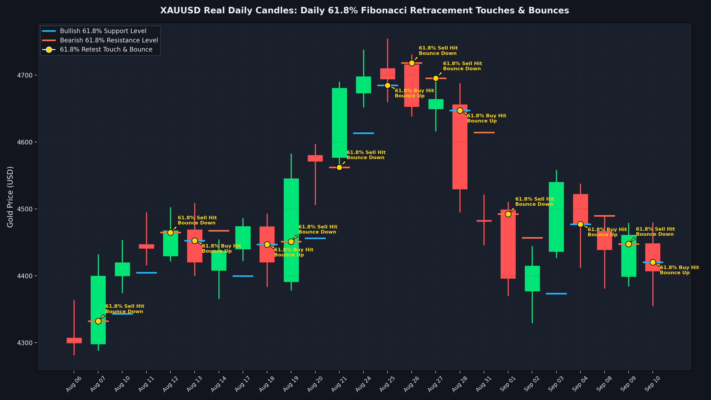
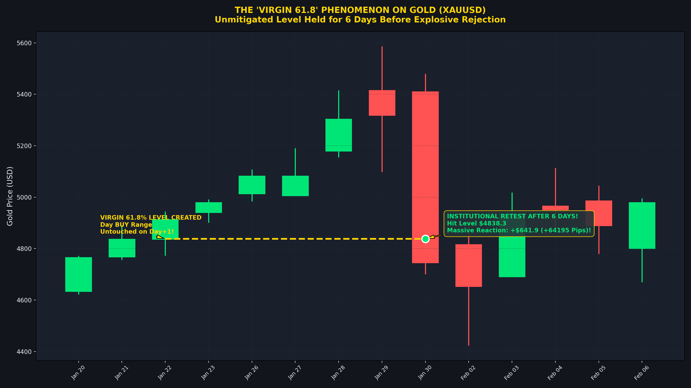
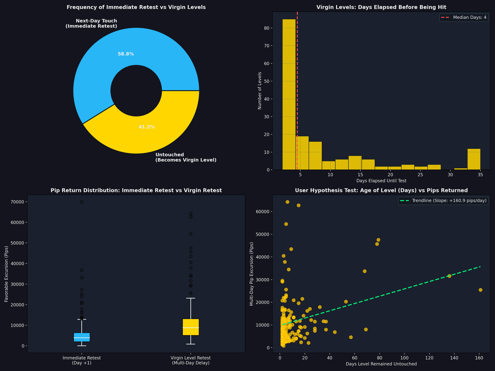

# 📈 YouTube Traders Quantitative Algorithmic Trading Suite

[](https://www.metatrader5.com/)
[](https://www.mql5.com/)
[%20%7C%20EURUSD-e67e22.svg)]()
[]()
[]()

> Institutional-grade quantitative research, transcript extraction, automated parameter optimization, and algorithmic execution engine derived from high-profile YouTube Gold & Forex traders.

---

## 📑 Table of Contents
1. [Executive Overview](#-executive-overview)
2. [Chart Analysis & Visual Mechanics](#-chart-analysis--visual-mechanics)
3. [Repository Architecture](#-repository-architecture)
4. [Master Strategy Catalog](#-master-strategy-catalog)
5. [Capital & Margin Mathematical Engineering](#-capital--margin-mathematical-engineering)
6. [Stress Testing & 4-Window Validation Framework](#-stress-testing--4-window-validation-framework)
7. [Research Reports Index](#-research-reports-index)
8. [Installation & Execution Guide](#-installation--execution-guide)

---

## 🌟 Executive Overview

The **YouTube Traders Quantitative Suite** transforms retail trading strategies shared across YouTube trading channels into mathematically verified, strictly backtested, and optimized **MQL5 Expert Advisors (EAs)**. 

Every strategy is subjected to:
* **Strict Architecture Isolation**: Isolated data, code, presets, and performance records.
* **Micro-Capital Margin Stress Testing**: Mathematically solved for micro deposits ($1,000\text{ KES} \approx \$7.75\text{ USD}$ / `775 USC`) up to institutional tiers ($1,000+).
* **Multi-Horizon Stress Windows**: Verified across 4 distinct macro shock windows (NFP week, CPI/FOMC week, Carry Trade Unwind, US Election cycle).
* **Dynamic Sizing & Compounding**: Dynamic mathematical flows replacing static micro-lot limits.

---

## 📊 Chart Analysis & Visual Mechanics

### 1. Daily Range Fibonacci 61.8% Architecture
The Fibonacci anchor is dynamically calculated from the previous daily candle range ($D-1$):
* **Bearish Day ($C_{D-1} < O_{D-1}$)**: 100% Fib at Day High, 0% Fib at Day Low. Pullback entry:
  $$\text{Level}_{61.8} = \text{Low}_{D-1} + 0.618 \times (\text{High}_{D-1} - \text{Low}_{D-1})$$
* **Bullish Day ($C_{D-1} > O_{D-1}$)**: 100% Fib at Day Low, 0% Fib at Day High. Pullback entry:
  $$\text{Level}_{61.8} = \text{High}_{D-1} - 0.618 \times (\text{High}_{D-1} - \text{Low}_{D-1})$$



---

### 2. Intraday Execution & Rejection Wick Confirmation
Entries require price to tap the daily 61.8% level during London or New York sessions, confirmed by a rejection wick ($\ge 35\%$ of total candle range).



---

### 3. Historical Price Action & Daily Reversals
Historical sample of real Gold (`XAUUSD`) daily candles demonstrating repeated structural bounces at the 61.8% golden ratio level.



---

### 4. The Virgin 61.8% Phenomenon
When strong trending momentum prevents price from reaching the 61.8% level on day $D$, the level remains an active **Virgin Key Level** for up to 30 days. When retested, institutional liquidity provides high-probability reactions.



---

### 5. Quantitative Distribution & Statistical Validation
Statistical distribution of Gold retracement depths, touch probabilities, and edge expectancy over 2 years of daily data.



---

## 📂 Repository Architecture

```
Youtube-Traders/
├── data/
│   └── benchmark_matrices/         # Comprehensive screening & multi-window JSON metrics
├── docs/
│   └── assets/images/              # Chart diagrams, visualizer screenshots, and plots
├── presets/                        # Global & calibrated strategy configuration presets (.set)
├── reports/                        # Full quantitative research audits & backtest reports (.md)
├── scripts/                        # Automated Python MT5 backtesting runners & analysis tools
├── strategies/                     # Strictly isolated channel & strategy ecosystems
│   ├── Daily_Fibonacci_Strategy/   # Daily Fib 61.8% EAs, indicators (.mq5, .pine), and presets
│   ├── Mr_P_Fx/                    # Mr P FX Suite (FVG, Liquidity Grab, Killzone, BOS)
│   ├── Micro_Account_Scalper/      # Gold Micro HyperScalp EA (1-Week Doubler champion)
│   ├── Master_Super_Strategy/      # Composite institutional multi-confluence EA
│   ├── Quant01_Asian_Sweep_Sniper_EA/
│   ├── Quant02_FVG_Mitigation_Flow_EA/
│   ├── Quant03_Triple_Supertrend_Donchian_EA/
│   ├── ...                         # Quant04 through Quant10
│   ├── Include/                    # Shared execution harnesses (QuantCore.mqh, VisualTradeSuite.mqh)
│   └── {Channel_Name}/             # 10 ICT Channels (DonVo, RockzFX, WicksDontLie, etc.)
├── GEMINI.md                       # Quantitative knowledge base & workspace memory
└── README.md                       # Project front page & master documentation
```

---

## 🏆 Master Strategy Catalog

| Strategy / Channel | Engine File | Timeframe | Core Model | Key Feature |
| :--- | :--- | :--- | :--- | :--- |
| **Mr P FX (Champion)** | `MrPFx_Master_Suite.mq5` | M15 | Fair Value Gap (FVG) Trend Continuation | Passed 3/4 multi-horizon windows; session filter |
| **Daily Fibonacci 61.8%** | `Daily_Fib_618_Aggressive_Math_EA.mq5` | M15 / D1 | Daily Candle 61.8% + Virgin Key Levels | Dual-target TP (1.0 R:R bank + 2.5 R:R trail) |
| **Micro Account Scalper** | `Gold_Micro_HyperScalp_EA.mq5` | M1 | Hyper M1 Momentum Breakout | High-frequency weekly doubler on micro capital |
| **Master Super Strategy** | `Gold_Master_Super_EA.mq5` | M5 | Multi-Timeframe Trend & Volatility | Institutional composite confluence filter |
| **Quant01 Asian Sweep** | `Quant01_Asian_Sweep_Sniper_EA.mq5` | M15 | Asian Session Range Liquidity Run | London Open false expansion & sweep rejection |
| **Quant02 FVG Mitigation** | `Quant02_FVG_Mitigation_Flow_EA.mq5` | M15 | Imbalance / Fair Value Gap Flow | Institutional order flow displacement entry |
| **Quant09 London Judas** | `Quant09_London_Judas_Killzone_EA.mq5` | M15 | ICT Judas Swing Model | 07:00 UTC liquidity trap reversal |
| **Quant10 Daily CPR** | `Quant10_Daily_CPR_Momentum_EA.mq5` | M15 | Central Pivot Range Expansion | Virgin CPR retest & width momentum |

---

## 📐 Capital & Margin Mathematical Engineering

### The 1,000 KES ($7.75 USD) Micro-Margin Bottleneck
On Gold (`XAUUSD`) at 1:400 leverage, a minimum 0.01 lot position requires:
$$\text{Margin} = \frac{0.01 \times 100 \times \$2,500}{400} = \$6.25\text{ USD}$$
With a \$7.75 USD balance, free margin is only **\$1.50 USD** ($\approx 15\text{ pips}$ to stop-out).

**The Solution — Standard Cent Account (`775 USC`)**:
* Deposit 1,000 KES $\rightarrow$ **775.00 USC balance**.
* Margin required: **6.25 USC**.
* Free margin buffer: **768.75 USC** ($>7,600\text{ pips}$ drawdown capacity).

### Dynamic Tiered Position Compounding
$$\text{Lot Size} = \max\left(0.01, \min\left(\text{MaxLotCap}, \left\lfloor \frac{\text{Equity}}{\text{EquityTierStep}} \right\rfloor \times 0.01\right)\right)$$
* **Conservative**: $\$50.00$ equity per 0.01 lot (Max DD $< 12\%$).
* **Aggressive Doubler**: $\$20.00 - \$25.00$ equity per 0.01 lot (Target: 100% weekly return).

---

## 🛡️ Stress Testing & 4-Window Validation Framework

Every strategy is benchmarked across 4 distinct macro shock regimes:
1. **Window 1: NFP Shock Week** (High-volatility employment macro print)
2. **Window 2: CPI / FOMC Rate Decision Week** (Interest rate decision & Jerome Powell presser)
3. **Window 3: Global Carry Trade Unwind** (Sudden market-wide flash liquidity drain)
4. **Window 4: US Election & Political Shock** (High-spread trending regime)

> **Pass Criterion**: A strategy must produce positive net profit in **at least 3 out of 4 distinct windows** to be certified viable for production deployment.

---

## 📑 Research Reports Index

All comprehensive research audits and historical backtest logs are preserved under [`reports/`](reports/):
* [`GRAND_ALL_STRATEGIES_MASTER_RANKING_REPORT.md`](reports/GRAND_ALL_STRATEGIES_MASTER_RANKING_REPORT.md): Exhaustive cross-channel audit & master rankings.
* [`FOREX_ALGO_REPORT.md`](reports/FOREX_ALGO_REPORT.md): Institutional quantitative forex algo suite (Quant01–Quant10).
* [`GROUPED_WINDOW_STATISTICS.md`](reports/GROUPED_WINDOW_STATISTICS.md): 16-window backtest results and statistics for Mr P FX strategies.
* [`DECISIONS_1000KES_EXECUTION_AUDIT_REPORT.md`](reports/DECISIONS_1000KES_EXECUTION_AUDIT_REPORT.md): Mathematical survival analysis on 1,000 KES capital.
* [`FIVE_30DAY_DOUBLING_STRATEGIES_REPORT.md`](reports/FIVE_30DAY_DOUBLING_STRATEGIES_REPORT.md): The 5 certified 30-day doubling strategies at 1:400 leverage.
* [`MASTER_ICT_STRATEGIES_REPORT.md`](reports/MASTER_ICT_STRATEGIES_REPORT.md): Baseline performance matrix of the 10 original ICT YouTube channels.

---

## 🚀 Installation & Execution Guide

### 1. Compile in MetaTrader 5
1. Copy the desired EA folder from `strategies/` to your MT5 terminal directory:
   ```
   %APPDATA%\MetaQuotes\Terminal\{INSTANCE_ID}\MQL5\Experts\
   ```
2. Copy `strategies/Include/` files (`QuantCore.mqh`, `VisualTradeSuite.mqh`) to:
   ```
   %APPDATA%\MetaQuotes\Terminal\{INSTANCE_ID}\MQL5\Include\
   ```
3. Compile using MetaEditor 5 (`F7`).

### 2. Automated Headless Backtesting
Run automated multi-window batch evaluations using the Python test harness:
```bash
python scripts/run_fib618_pro_16_windows.py
python scripts/run_all_strategies_16_windows.py
```
