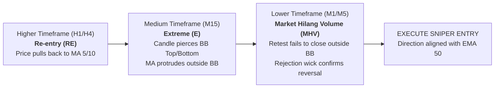

# Ahmad Danial (@Danialfx) Quantitative Algorithmic Trading Guide
## Master Strategy Breakdown: Quasimodo (QM), BBMA REM, AO Momentum & Aggressive Profit Layering

---

## 1. Executive Channel & Trader Profile
* **Creator**: Ahmad Danial (YouTube: `@Danialfx`, 200k+ subscribers)
* **Trading Identity**: High-octane aggressive price action scalper and day trader specializing in **Gold (`XAUUSD`)** and **US30 (Dow Jones)**.
* **Core Philosophy**: Extreme small-account compounding ($20, $50, $100 up to thousands) through sniper structural reversals and aggressive **profit layering** (pyramiding into winning momentum runs while locking prior trades to breakeven).
* **Key Setups**:
  1. **Quasimodo (QM) / QML Setup** with Supply & Demand (SND / SNR) confluence.
  2. **Awesome Oscillator (AO) Divergence & Zero-Line Confirmation**.
  3. **BBMA REM (Re-entry, Extreme, Market Hilang Volume)** Multi-Timeframe alignment.
  4. **Aggressive Layering & Margin Compounding** (Adding positions as price moves in profit).

---

## 2. Quantitative Model 1: Quasimodo (QM) Sniper Reversal Engine

The Quasimodo pattern is a high-probability institutional market structure reversal setup created when liquidity is swept at a new extreme followed by an immediate aggressive Break of Structure (BOS).

```mermaid
flowchart TD
    subgraph Bullish_QM["Bullish Quasimodo (Buy Setup)"]
    L["Swing Low (Left Shoulder)"] --> H["Swing High"]
    H --> LL["Lower Low (Liquidity Grab / Head)"]
    LL --> HH["Higher High (BOS - Breaks above H)"]
    HH --> RETEST_B["Pullback to Left Shoulder Level (QML)"]
    RETEST_B --> BUY["Sniper BUY Entry at QML<br/>SL below Head (LL)"]
    end

    subgraph Bearish_QM["Bearish Quasimodo (Sell Setup)"]
    H2["Swing High (Left Shoulder)"] --> L2["Swing Low"]
    L2 --> HH2["Higher High (Liquidity Grab / Head)"]
    HH2 --> LL2["Lower Low (BOS - Breaks below L2)"]
    LL2 --> RETEST_S["Pullback to Left Shoulder Level (QML)"]
    RETEST_S --> SELL["Sniper SELL Entry at QML<br/>SL above Head (HH2)"]
    end
```

### Mathematical Formulation:
* **Bearish QM Identification**:
  1. Point $H_1$ (Left Shoulder High) established at time $t_1$.
  2. Point $L_1$ (Interim Low) established at time $t_2 > t_1$.
  3. Point $H_2$ (Head / Higher High) established at $t_3 > t_2$ where $H_2 > H_1 + \Delta_{\text{sweep}}$.
  4. Point $L_2$ (Lower Low / BOS) established at $t_4 > t_3$ where $L_2 < L_1 - \Delta_{\text{break}}$.
  5. **QML Zone**: Defined as $[H_1 - \epsilon, H_1 + \epsilon]$ where $\epsilon$ is the SND base buffer.
  6. **Sell Trigger**: Price returns to QML zone $[H_1 - \epsilon, H_1 + \epsilon]$.
  7. **Stop Loss**: $H_2 + \text{Spread} + \text{Buffer}$.
  8. **Target 1**: $L_1$ (1:1 to 1:2 R:R). **Target 2**: Extended runner (1:3+ R:R).

* **Bullish QM Identification**:
  1. Point $L_1$ (Left Shoulder Low) established at time $t_1$.
  2. Point $H_1$ (Interim High) established at time $t_2 > t_1$.
  3. Point $L_2$ (Head / Lower Low) established at $t_3 > t_2$ where $L_2 < L_1 - \Delta_{\text{sweep}}$.
  4. Point $H_2$ (Higher High / BOS) established at $t_4 > t_3$ where $H_2 > H_1 + \Delta_{\text{break}}$.
  5. **QML Zone**: Defined as $[L_1 - \epsilon, L_1 + \epsilon]$.
  6. **Buy Trigger**: Price retraces into QML zone $[L_1 - \epsilon, L_1 + \epsilon]$.
  7. **Stop Loss**: $L_2 - \text{Spread} - \text{Buffer}$.
  8. **Target 1**: $H_1$. **Target 2**: Extended runner (1:3+ R:R).

---

## 3. Quantitative Model 2: QM + Awesome Oscillator (AO) Momentum Confluence

Ahmad Danial frequently pairs the Quasimodo setup with the **Awesome Oscillator (AO)** to filter out "fake QMs" (as detailed in his video *Why QM Failed?* and *AO SND SNR QM*):

$$\text{AO} = \text{SMA}(\text{Median Price}, 5) - \text{SMA}(\text{Median Price}, 34)$$
$$\text{Median Price} = \frac{\text{High} + \text{Low}}{2}$$

### Filter & Confluence Rules:
1. **Bearish Divergence at Head**: When price prints Higher High ($H_2 > H_1$), the AO value at $H_2$ must be lower than at $H_1$ ($\text{AO}(H_2) < \text{AO}(H_1)$), signaling institutional momentum exhaustion.
2. **Bullish Divergence at Head**: When price prints Lower Low ($L_2 < L_1$), the AO value at $L_2$ must be higher than at $L_1$ ($\text{AO}(L_2) > \text{AO}(L_1)$).
3. **Trigger Bar Color Confluence**: Upon reaching the QML entry zone:
   - For Buy: AO bar is green (rising momentum) or crosses above zero line.
   - For Sell: AO bar is red (falling momentum) or crosses below zero line.

---

## 4. Quantitative Model 3: BBMA REM Setup (Re-entry, Extreme, MHV)

Extracted from Danial's tutorials *BASIC BBMA*, *BBMA | REM Setup*, and *$300 to $2600 | BBMA Multi-timeframe*:

### BBMA Indicator Architecture:
* **Bollinger Bands**: Period 20, Deviation 2.0 (`Top BB`, `Mid BB`, `Low BB`).
* **Moving Averages**:
  - `MA 5 High` & `MA 5 Low` (Shift 0, Linear Weighted/Simple).
  - `MA 10 High` & `MA 10 Low` (Shift 0).
  - `EMA 50` (Trend backbone: Price above EMA 50 = Bullish bias, below = Bearish bias).

---

## 5. Quantitative Model 4: Danial FX's Aggressive Layering & Profit Pyramiding Engine

This is Ahmad Danial's signature technique that enables account doubling and 100x account scaling from small capital ($20, $50, $100):

### The Stacking & Layering Mathematical Protocol:
1. **Initial Layer 1 Entry**: Opened upon structural trigger (QM or BBMA) with base lot calculated from current equity tier.
2. **First Breakeven Trigger**:
   - When Layer 1 reaches $+\text{StepPoints}$ (e.g., $+350$ points / $35$ pips on Gold):
   - **Immediately modify Layer 1 Stop Loss to Breakeven $+ 10\text{ points}$** (guarantees risk-free trade).
3. **Execution of Layer 2**:
   - As soon as Layer 1 is secured at breakeven, **open Layer 2 in the same direction**!
   - Layer 2 has its SL set to the entry price of Layer 1 or current swing structure.
4. **Execution of Layer 3 & Cascading Trailing Stop**:
   - When price advances another $+\text{StepPoints}$ (total $+700$ points from initial):
   - Layer 1 SL is moved into $+350$ points profit.
   - Layer 2 SL is moved to Breakeven $+ 10\text{ points}$.
   - **Open Layer 3**!
5. **Net Risk Profile**:
   $$\text{Maximum Real Risk} = \text{Risk of Layer 1 only}$$
   Once Layer 1 is at Breakeven, **Total Cumulative Risk of the entire basket is $\le \$0.00$**, while upside profit grows exponentially with $O(N^2)$ geometry!

---

## 6. Sizing Tiers for $20, $50, $100, and $1,000 Accounts

| Account Balance | Base Lot Cap | Equity Tier Step | Max Stacking Layers | Risk per Trade | Target Objective |
| :--- | :--- | :--- | :--- | :--- | :--- |
| **$20 Micro Account** | `0.01` lot | $\$15.00$ per 0.01 | 2 layers | Full-margin micro | Fast Account Doubler (2x to 5x) |
| **$50 Small Account** | `0.02` lot | $\$25.00$ per 0.01 | 3 layers | Aggressive | $50 \rightarrow \$200+$ |
| **$100 Growth Account** | `0.04` lot | $\$30.00$ per 0.01 | 4 layers | Balanced aggressive | $100 \rightarrow \$500+$ |
| **$1,000 High-Roller** | `0.30` lot | $\$50.00$ per 0.01 | 5 layers | Institutional aggressive | Scaling to $5k-$10k |

---

## 7. Execution Timing & Session Filters
* **Primary Trading Pair**: `XAUUSD` (Gold).
* **High Volatility Killzones**:
  - London Open Killzone: 07:00 – 11:00 UTC.
  - New York Overlap / Open Killzone: 12:30 – 17:00 UTC.
* **Spread Circuit Breaker**: Disable execution if Gold spread exceeds $45\text{ points}$ ($4.5\text{ pips}$).
